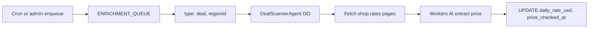

# Deal Scanner Agent (planned)

> **Status:** Wiring only — queue messages with `type: "deal"` are accepted and logged
> to `agent_runs`, but no Durable Object implementation exists yet.

## Purpose

Keep `ski_rentals.daily_rate_usd` fresh so resort detail pages and geo search can sort
by **price**, **distance**, and **best value** (`daily_rate_usd + $2 × distance_miles`).

Manual migrations and [`docs/rental-research-guide.md`](./rental-research-guide.md)
seed initial prices. The Deal Scanner Agent refreshes them on a schedule.

## Planned architecture



## Per-region workflow

1. Select rentals in the region where `price_checked_at` is NULL or older than 7 days.
2. For each shop with a `website`, fetch the rates page (respect robots, rate-limit).
3. Use Workers AI to extract the **adult standard one-day ski package** price (same
   rules as the rental research guide: cheapest tier, skis + boots + poles, whole USD).
4. `UPDATE ski_rentals SET daily_rate_usd = ?, price_checked_at = datetime('now') WHERE slug = ?`
5. Log to `agent_runs` with `agent_type = 'deal'`.

## Triggering today (stub)

```bash
curl -X POST https://ski-slop.example/api/admin/enqueue \
  -H "Authorization: Bearer $ADMIN_TOKEN" \
  -H "Content-Type: application/json" \
  -d '{"regionSlug":"us-id","type":"deal"}'
```

The queue consumer records a run with status `failed` and message
`DealScannerAgent not implemented yet` until the DO is built.

## Implementation checklist (future)

- [ ] `workers/agents/deal-agent.ts` — `DealScannerAgent` Durable Object
- [ ] `workers/agents/tools/pricing.ts` — HTTP fetch + AI parse
- [ ] `updateRentalPrice()` in `workers/agents/tools/d1.ts`
- [ ] Wrangler DO binding + export from `workers/site/index.ts`
- [ ] Cron: enqueue `deal` for regions with stale rental prices
- [ ] Optional: surface “last checked” on rental cards in the UI
